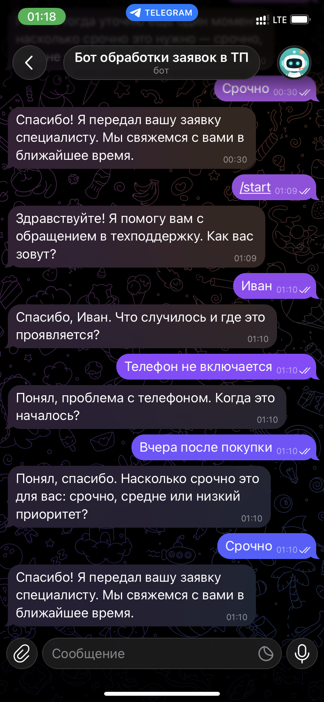
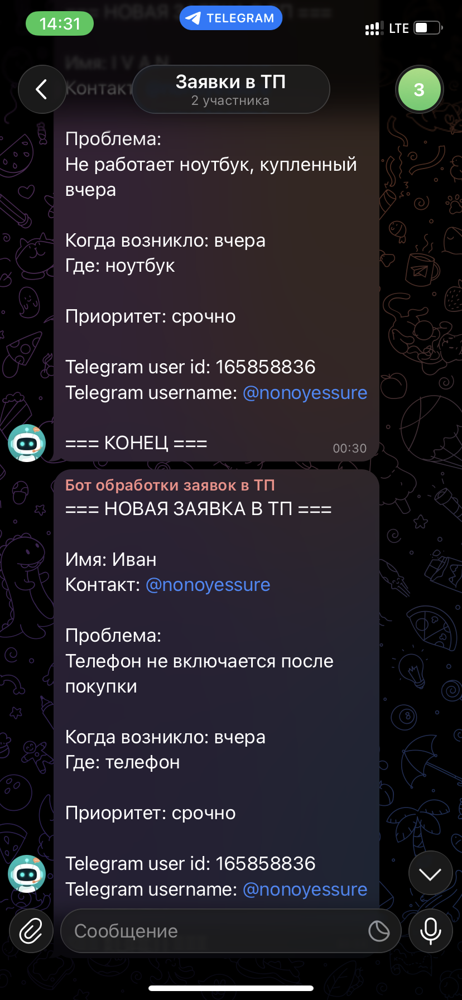

<div align="center">

# 🤖 AI Support Ticket Assistant


**Telegram-бот для первичной обработки входящих заявок в техподдержку**

[Описание](#-описание-проекта) • [Бизнес-цель](#-бизнес-цель) • [Технологии](#-технологии) • [Архитектура](#-архитектура) • [Скриншоты](#-скриншоты) • [Установка](#-установка-и-настройка) • [Деплой](#-деплой-на-сервер) • [Структура](#-структура-проекта) • [Лицензия](#-лицензия) • [Заключение](#-заключение) • [Контакты](#-контакты)

</div>

---

## 📋 Описание проекта

**AI Support Ticket Assistant** — это Telegram-бот для первичной обработки входящих заявок в техподдержку. Бот выступает в роли ассистента первой линии: отвечает на вопросы клиента, задаёт уточняющие вопросы, собирает необходимые данные и передаёт структурированную заявку в чат операторов.

### Основные возможности

- 🤖 **ИИ-обработка диалога** — извлечение данных из свободного текста через GPT-5.4-mini
- 💬 **Диалоговый интерфейс** — естественное общение с клиентом в Telegram
- 📋 **Структурированная заявка** — автоматическое формирование заявки из переписки
- 📤 **Уведомление операторам** — готовая заявка отправляется в Telegram-чат операторов
- 🔄 **Валидация данных** — проверка корректности введённых данных
- 🐳 **Docker-развёртывание** — простое деплоирование на любой сервер

### Бизнес-цель

**Проблема:** Менеджеры техподдержки тратят до 15 минут на первичную обработку каждой заявки. Клиенты описывают проблему в свободной форме, данные разрознены, менеджерам приходится задавать уточняющие вопросы вручную.

**Решение:** Бот автоматизирует первичную обработку заявок: задаёт уточняющие вопросы, собирает обязательные данные, формирует структурированную заявку и передаёт её оператору. Это снижает нагрузку на менеджеров, ускоряет сбор информации и улучшает качество данных.

---

## 🛠 Технологии

| Категория | Технологии |
|-----------|------------|
| **Язык программирования** | Python 3.12+ |
| **Telegram Bot** | aiogram 3.7+ (async) |
| **LLM** | GPT-5.4-mini через ProxyAPI |
| **HTTP Client** | httpx (async) |
| **Валидация** | Pydantic v2 |
| **Конфигурация** | pydantic-settings |
| **Инфраструктура** | Docker, Docker Compose |

---

## 🏗 Архитектура

```
┌─────────────────────────────────────────────────────────────────┐
│                    Telegram Client (Mobile/Web)                 │
│                    Клиент пишет боту                             │
└─────────────────────────────────────────────────────────────────┘
                              │
                              ▼
┌─────────────────────────────────────────────────────────────────┐
│                 Telegram Bot (aiogram Dispatcher)               │
│                                                                 │
│  ┌──────────────┐  ┌──────────────┐  ┌──────────────┐           │
│  │ /start       │  │ /reset       │  │ Текстовые    │           │
│  │ Команда      │  │ Команда      │  │ Сообщения    │           │
│  └──────────────┘  └──────────────┘  └──────────────┘           │
│         │                 │                  │                  │
│         ▼                 ▼                  ▼                  │
│  ┌─────────────────────────────────────────────────────────┐    │
│  │           SupportWorkflowService                         │    │
│  │  (оркестрация диалога, проверка заполненности, отправка) │    │
│  └─────────────────────────────────────────────────────────┘    │
│                              │                                   │
│         ┌────────────────────┴────────────────────┐              │
│         ▼                                         ▼              │
│  ┌─────────────────┐                     ┌─────────────────┐     │
│  │ OpenAISupport   │                     │ Operator        │     │
│  │ Assistant       │                     │ Notifier        │     │
│  │ (извлечение     │                     │ (отправка       │     │
│  │  данных через   │                     │  заявки в чат)  │     │
│  │  LLM)           │                     │                 │     │
│  └─────────────────┘                     └─────────────────┘     │
│                                                                 │
└─────────────────────────────────────────────────────────────────┘
                              │
        ┌─────────────────────┼─────────────────────┐
        ▼                     ▼                     ▼
┌───────────────┐    ┌───────────────┐    ┌───────────────┐
│  InMemory     │    │  OpenAI       │    │  Telegram     │
│  Session      │    │  API          │    │  API          │
│  Repository   │    │  (ProxyAPI)   │    │  (Bot)        │
│  (сессии в    │    │               │    │               │
│  памяти)      │    │               │    │               │
└───────────────┘    └───────────────┘    └───────────────┘
```

---

## 📸 Скриншоты

### Диалог с ботом и сбор данных



### Уведомление операторам в чате



---

## 🚀 Установка и настройка

### Предварительные требования

- Python 3.12+
- Docker Desktop
- API-ключ OpenAI (ProxyAPI)
- Telegram Bot Token (от @BotFather)

### Клонирование репозитория

```bash
git clone <repository-url>
cd incoming-lids-bot
```

### Создание виртуального окружения

```bash
python -m venv .venv
.venv\Scripts\activate        # Windows
source .venv/bin/activate     # Linux/macOS
```

### Установка зависимостей

```bash
pip install -r requirements.txt
```

### Настройка переменных окружения

```powershell
Copy-Item .env.example .env
```

Отредактируйте `.env`, внеся свои значения

> **Важно:** VPN обязателен для доступа к Telegram API и ProxyAPI в некоторых сетях.

### Запуск локально

```bash
python main.py
```

### Запуск в Docker

```powershell
# Построить образ
docker build -t incoming_lids .

# Запустить контейнер
docker run -d --name bot --env-file .env incoming_lids

# Проверить логи
docker logs -f bot

# Остановить
docker stop bot
docker rm bot
```

---

## 🌐 Деплой на сервер

### Экспорт образа локально

```powershell
# Экспортировать образ
docker save incoming_lids -o incoming_lids.tar

# Передать на сервер
scp incoming_lids.tar root@<сервер>/root/

# Передать .env файл
scp .env root@<сервер>/root/
```

### На сервере (Ubuntu)

```bash
# Установить Docker (если нет)
apt update
apt install -y docker.io
systemctl start docker
systemctl enable docker

# Загрузить образ
docker load < incoming_lids.tar

# Проверить
docker images

# Запустить контейнер
docker run -d --name bot --env-file .env incoming_lids

# Проверить логи
docker logs -f bot
```

### Управление контейнером

```bash
# Перезапуск
docker restart bot

# Остановка
docker stop bot

# Удаление
docker rm bot
```

---

## 📁 Структура проекта

```
incoming-lids-bot/
├── main.py                          # Точка входа
├── requirements.txt                 # Зависимости
├── .env.example                     # Шаблон переменных окружения
├── .gitignore                       # Исключения для Git
├── Dockerfile                       # Образ для деплоя
├── LICENSE                          # Лицензия MIT
├── REPORT.md                        # Отчёт по адаптации проекта
├── README.md                        # Документация проекта
│
├── bot/                             # Telegram бот
│   ├── __init__.py
│   ├── main.py                      # Запуск бота, инициализация
│   └── handlers/
│       ├── __init__.py
│       └── support.py               # Обработчики сообщений (/start, /reset, текст)
│
├── core/                            # Ядро бизнес-логики
│   ├── __init__.py
│   ├── config.py                    # Pydantic Settings (env)
│   ├── logging.py                   # Конфигурация логирования
│   └── schemas.py                   # Pydantic модели (SupportTicket, SupportSession, AssistantTurn)
│
├── services/                        # Сервисный слой
│   ├── __init__.py
│   ├── workflow.py                  # SupportWorkflowService (оркестрация диалога)
│   │
│   ├── assistant/
│   │   ├── __init__.py
│   │   ├── openai_support_assistant.py  # Вызов LLM, извлечение данных
│   │   └── prompts.py               # Системный промпт, JSON Schema
│   │
│   ├── storage/
│   │   ├── __init__.py
│   │   └── session_repository.py    # InMemorySessionRepository
│   │
│   └── telegram/
│       ├── __init__.py
│       └── operator_notifier.py     # Отправка заявки в чат операторов
│
└── docs/
    └── images/                      # Скриншоты
```

---

## 📖 Детальное описание компонентов

### Ядро системы (Core)

**Схемы данных** (`core/schemas.py`)

| Сущность | Поля | Описание |
|----------|------|----------|
| **SupportTicket** | `name`, `contact`, `problem_summary`, `occurred_at`, `location`, `priority` | Данные заявки |
| **DialogueMessage** | `role`, `text` | Сообщение в диалоге (user/assistant) |
| **AssistantTurn** | `reply`, `extracted_ticket`, `ready_to_submit` | Ответ LLM пользователю |
| **SupportSession** | `user_id`, `chat_id`, `ticket`, `history`, `started`, `submitted` | Состояние сессии |

**Методы:**
- `SupportTicket.is_complete()` — проверка заполненности всех полей
- `SupportTicket.merge()` — объединение данных из нового ответа
- `SupportSession.reset()` — сброс сессии
- `SupportSession.recent_history()` — последние 8 сообщений

**Конфигурация** (`core/config.py`)

```python
class Settings(BaseSettings):
    telegram_bot_token: str
    operator_chat_id: int
    openai_api_key: str
    openai_model: str = "gpt-5.4-mini"
    openai_base_url: str = "https://api.proxyapi.ru/openai/v1"
    log_level: str = "INFO"
```

### Telegram Бот (Bot)

**Обработчики** (`bot/handlers/support.py`)

| Хендлер | Команда/Фильтр | Действие |
|---------|----------------|----------|
| `handle_start` | `/start` | Создание сессии, приветствие |
| `handle_reset` | `/reset` | Сброс сессии, начало заново |
| `handle_text_message` | `F.text` | Обработка сообщения, вызов workflow |
| `handle_unsupported_message` | (по умолчанию) | Ответ на некорректный ввод |

### Сервисный слой (Services)

| Сервис | Ответственность |
|--------|-----------------|
| **SupportWorkflowService** | Оркестрация диалога, проверка заполненности, отправка заявки |
| **OpenAISupportAssistant** | Вызов LLM, извлечение данных, fallback-логика |
| **InMemorySessionRepository** | Хранение сессий в памяти (до перезапуска бота) |
| **OperatorNotifier** | Отправка готовой заявки в Telegram-чат |

**OpenAI Assistant** (`services/assistant/openai_support_assistant.py`)

- Вызов `/chat/completions` через httpx
- Retry-логика для статусов 408, 409, 429, 500, 502, 503, 504
- Fallback на локальную логику при ошибке LLM
- JSON Schema для строгого ответа

**Системный промпт** (`services/assistant/prompts.py`)

- Роль: ассистент первой линии техподдержки
- Flow: имя → контакт → проблема → когда началось → где проявляется → приоритет
- Правила: не спрашивать уже известные данные, максимум один вопрос в ответе
- JSON Schema: `reply`, `extracted_ticket`, `ready_to_submit`

---

## 📄 Лицензия

MIT License — подробности в файле [LICENSE](LICENSE)

---

## 🎯 Заключение

**AI Support Ticket Assistant** — готовое решение для автоматизации первичной обработки заявок в техподдержку. Бот выступает в роли первой линии поддержки: отвечает на вопросы клиента, задаёт уточняющие вопросы, собирает данные и передаёт заявку дальше в чат менеджеров.

**Бизнес-логика решения:**
1. Клиент отправляет сообщение боту
2. Бот начинает диалог и задаёт вопросы
3. Постепенно собирает данные: имя, контакт, запрос или проблема
4. Проверяет корректность введённых данных
5. Формирует структурированную заявку
6. Передаёт её в чат менеджеру

**Ключевые возможности:**
- ИИ-обработка диалога через GPT-5.4-mini
- Пошаговый сбор данных с валидацией
- Уведомление операторов в Telegram
- Простое Docker-развёртывание

**Эффекты для бизнеса:**
- Сокращение времени на первичную обработку заявки с 15 до 3–5 минут
- Автоматизация сбора обязательных данных
- Снижение нагрузки на менеджеров техподдержки
- Улучшение качества и полноты данных заявок

**Возможности для развития:**
- Подключение к CRM-системе (Bitrix24, AmoCRM)
- История записей в БД (сейчас — в памяти)
- Мультиязычность (английский, казахский)
- Интеграция с системами тикетинга (Jira, Zendesk)
- Аналитика и дашборды по заявкам
- Запись на консультацию к специалистам (юрист, психолог, врач, IT-консультант)

---

## 📞 Контакты

**Автор:** Ivan P  
**Telegram:** [@nonoyessure](https://t.me/nonoyessure)  

---

<div align="center">

**⭐ Ставьте звезду, если проект полезен!**

🚀

</div>
